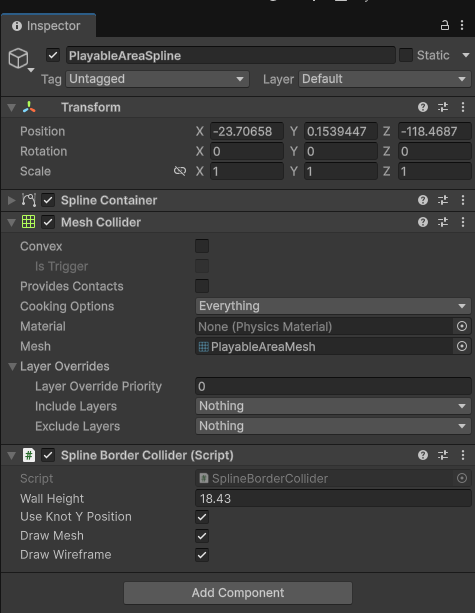
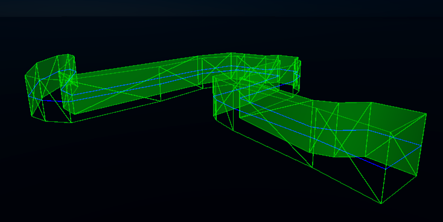

# Spline Border Collider

A tool to ease the creation of playable area borders in Unity. It automatically creates a plane mesh following the spline. Requires Splines package to be installed.

# Usage

Download zip and drop the folder into your Unity project. Create a border using splines around the desired playable area and attach this script to the Spline Container.

# Features

* Updates in realtime
* Height customization
* You can choose if you want to use the spline knots Y position or not
* Visualization with both wire mesh and normal mesh.

## Screenshots

